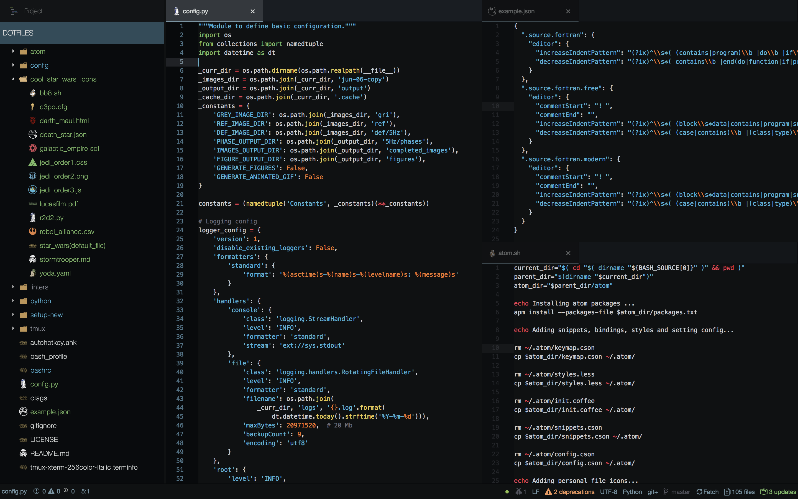

STAR WARS ATOM
--------------

Run `atom.sh` under `setup-new` and, if everything works, you should end up with something that looks like this:

This is done by joining together:

  - [`seti-ui`](https://atom.io/themes/seti-ui)

      \+

  - [`an-old-hope-syntax`](https://atom.io/themes/an-old-hope-syntax)

      \+

  - [`atom-file-icons`](https://atom.io/packages/atom-file-icons)

      \+

  - some personal touches...
